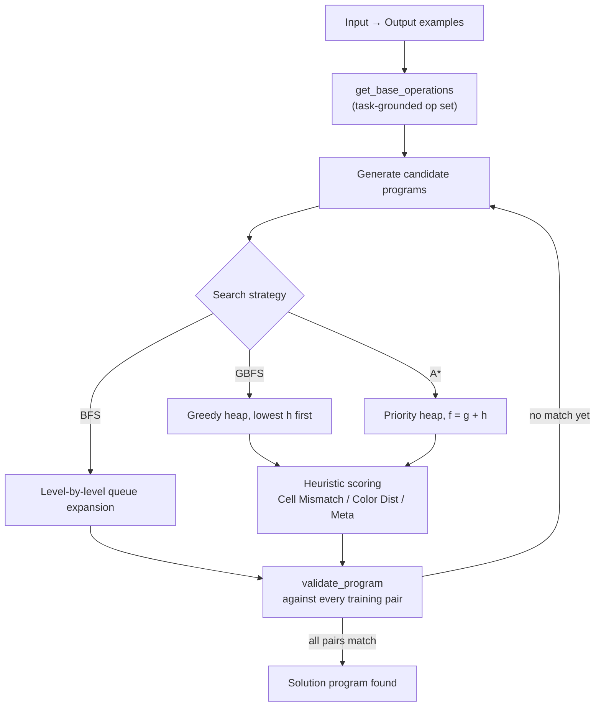

<div align="center">

# ARC-AGI Program Synthesis

<sub>Automated visual reasoning through intelligent program search</sub>

<br/>

<!--
  Hero visual: a literal ARC-AGI grid, rendered as an HTML table with
  inline style="background:#hex" on each <td>. This is deliberate —
  GitHub's markdown sanitizer strips the legacy bgcolor attribute, which
  silently renders every cell blank. style="background:#hex" survives
  sanitization, so this hero can never break the way an external
  banner-rendering service can.
-->
<table>
<tr>
<td align="center" valign="middle">

**Input**

<table cellspacing="0" cellpadding="0" style="border-collapse:collapse;border:2px solid #888;margin:0 auto;">
<tr><td width="20" height="20" style="width:20px;height:20px;background:#AAAAAA;border:1px solid #444;padding:0;line-height:0;font-size:0;"></td><td width="20" height="20" style="width:20px;height:20px;background:#AAAAAA;border:1px solid #444;padding:0;line-height:0;font-size:0;"></td><td width="20" height="20" style="width:20px;height:20px;background:#AAAAAA;border:1px solid #444;padding:0;line-height:0;font-size:0;"></td><td width="20" height="20" style="width:20px;height:20px;background:#000000;border:1px solid #444;padding:0;line-height:0;font-size:0;"></td><td width="20" height="20" style="width:20px;height:20px;background:#000000;border:1px solid #444;padding:0;line-height:0;font-size:0;"></td></tr>
<tr><td width="20" height="20" style="width:20px;height:20px;background:#AAAAAA;border:1px solid #444;padding:0;line-height:0;font-size:0;"></td><td width="20" height="20" style="width:20px;height:20px;background:#000000;border:1px solid #444;padding:0;line-height:0;font-size:0;"></td><td width="20" height="20" style="width:20px;height:20px;background:#000000;border:1px solid #444;padding:0;line-height:0;font-size:0;"></td><td width="20" height="20" style="width:20px;height:20px;background:#000000;border:1px solid #444;padding:0;line-height:0;font-size:0;"></td><td width="20" height="20" style="width:20px;height:20px;background:#000000;border:1px solid #444;padding:0;line-height:0;font-size:0;"></td></tr>
<tr><td width="20" height="20" style="width:20px;height:20px;background:#AAAAAA;border:1px solid #444;padding:0;line-height:0;font-size:0;"></td><td width="20" height="20" style="width:20px;height:20px;background:#000000;border:1px solid #444;padding:0;line-height:0;font-size:0;"></td><td width="20" height="20" style="width:20px;height:20px;background:#000000;border:1px solid #444;padding:0;line-height:0;font-size:0;"></td><td width="20" height="20" style="width:20px;height:20px;background:#000000;border:1px solid #444;padding:0;line-height:0;font-size:0;"></td><td width="20" height="20" style="width:20px;height:20px;background:#000000;border:1px solid #444;padding:0;line-height:0;font-size:0;"></td></tr>
<tr><td width="20" height="20" style="width:20px;height:20px;background:#AAAAAA;border:1px solid #444;padding:0;line-height:0;font-size:0;"></td><td width="20" height="20" style="width:20px;height:20px;background:#000000;border:1px solid #444;padding:0;line-height:0;font-size:0;"></td><td width="20" height="20" style="width:20px;height:20px;background:#000000;border:1px solid #444;padding:0;line-height:0;font-size:0;"></td><td width="20" height="20" style="width:20px;height:20px;background:#000000;border:1px solid #444;padding:0;line-height:0;font-size:0;"></td><td width="20" height="20" style="width:20px;height:20px;background:#000000;border:1px solid #444;padding:0;line-height:0;font-size:0;"></td></tr>
<tr><td width="20" height="20" style="width:20px;height:20px;background:#AAAAAA;border:1px solid #444;padding:0;line-height:0;font-size:0;"></td><td width="20" height="20" style="width:20px;height:20px;background:#000000;border:1px solid #444;padding:0;line-height:0;font-size:0;"></td><td width="20" height="20" style="width:20px;height:20px;background:#000000;border:1px solid #444;padding:0;line-height:0;font-size:0;"></td><td width="20" height="20" style="width:20px;height:20px;background:#000000;border:1px solid #444;padding:0;line-height:0;font-size:0;"></td><td width="20" height="20" style="width:20px;height:20px;background:#000000;border:1px solid #444;padding:0;line-height:0;font-size:0;"></td></tr>
</table>

</td>
<td align="center" valign="middle" style="padding:0 24px;">

<sub><code>Rotate(90)</code></sub><br/>
<sub><code>ColorChange(5, 8)</code></sub><br/>
<h2>→</h2>

</td>
<td align="center" valign="middle">

**Output**

<table cellspacing="0" cellpadding="0" style="border-collapse:collapse;border:2px solid #888;margin:0 auto;">
<tr><td width="20" height="20" style="width:20px;height:20px;background:#7FDBFF;border:1px solid #444;padding:0;line-height:0;font-size:0;"></td><td width="20" height="20" style="width:20px;height:20px;background:#7FDBFF;border:1px solid #444;padding:0;line-height:0;font-size:0;"></td><td width="20" height="20" style="width:20px;height:20px;background:#7FDBFF;border:1px solid #444;padding:0;line-height:0;font-size:0;"></td><td width="20" height="20" style="width:20px;height:20px;background:#7FDBFF;border:1px solid #444;padding:0;line-height:0;font-size:0;"></td><td width="20" height="20" style="width:20px;height:20px;background:#7FDBFF;border:1px solid #444;padding:0;line-height:0;font-size:0;"></td></tr>
<tr><td width="20" height="20" style="width:20px;height:20px;background:#000000;border:1px solid #444;padding:0;line-height:0;font-size:0;"></td><td width="20" height="20" style="width:20px;height:20px;background:#000000;border:1px solid #444;padding:0;line-height:0;font-size:0;"></td><td width="20" height="20" style="width:20px;height:20px;background:#000000;border:1px solid #444;padding:0;line-height:0;font-size:0;"></td><td width="20" height="20" style="width:20px;height:20px;background:#000000;border:1px solid #444;padding:0;line-height:0;font-size:0;"></td><td width="20" height="20" style="width:20px;height:20px;background:#7FDBFF;border:1px solid #444;padding:0;line-height:0;font-size:0;"></td></tr>
<tr><td width="20" height="20" style="width:20px;height:20px;background:#000000;border:1px solid #444;padding:0;line-height:0;font-size:0;"></td><td width="20" height="20" style="width:20px;height:20px;background:#000000;border:1px solid #444;padding:0;line-height:0;font-size:0;"></td><td width="20" height="20" style="width:20px;height:20px;background:#000000;border:1px solid #444;padding:0;line-height:0;font-size:0;"></td><td width="20" height="20" style="width:20px;height:20px;background:#000000;border:1px solid #444;padding:0;line-height:0;font-size:0;"></td><td width="20" height="20" style="width:20px;height:20px;background:#7FDBFF;border:1px solid #444;padding:0;line-height:0;font-size:0;"></td></tr>
<tr><td width="20" height="20" style="width:20px;height:20px;background:#000000;border:1px solid #444;padding:0;line-height:0;font-size:0;"></td><td width="20" height="20" style="width:20px;height:20px;background:#000000;border:1px solid #444;padding:0;line-height:0;font-size:0;"></td><td width="20" height="20" style="width:20px;height:20px;background:#000000;border:1px solid #444;padding:0;line-height:0;font-size:0;"></td><td width="20" height="20" style="width:20px;height:20px;background:#000000;border:1px solid #444;padding:0;line-height:0;font-size:0;"></td><td width="20" height="20" style="width:20px;height:20px;background:#000000;border:1px solid #444;padding:0;line-height:0;font-size:0;"></td></tr>
<tr><td width="20" height="20" style="width:20px;height:20px;background:#000000;border:1px solid #444;padding:0;line-height:0;font-size:0;"></td><td width="20" height="20" style="width:20px;height:20px;background:#000000;border:1px solid #444;padding:0;line-height:0;font-size:0;"></td><td width="20" height="20" style="width:20px;height:20px;background:#000000;border:1px solid #444;padding:0;line-height:0;font-size:0;"></td><td width="20" height="20" style="width:20px;height:20px;background:#000000;border:1px solid #444;padding:0;line-height:0;font-size:0;"></td><td width="20" height="20" style="width:20px;height:20px;background:#000000;border:1px solid #444;padding:0;line-height:0;font-size:0;"></td></tr>
</table>

</td>
</tr>
</table>

<sub>A real program the engine can discover on this task — search finds <code>Rotate(90) → ColorChange(5, 8)</code> and confirms it against every training pair.</sub>

<br/><br/>

[](https://www.python.org/)
[](LICENSE)
[](https://arcprize.org/)
[](program.py)

<sub>Given only a handful of input → output grid examples, this engine <b>searches for a program</b> that explains the transformation — no training, no neural nets, just search over a composable operation space.</sub>

<br/>

🧩 Solve visual reasoning puzzles with search &nbsp;•&nbsp; 🔍 BFS • GBFS • A* over program space &nbsp;•&nbsp; 🎨 Color • Geometric • Scaling • Positional ops &nbsp;•&nbsp; ⚙️ Zero dependencies — pure Python

<br/>

**[Overview](#-overview) • [Features](#-features) • [How It Works](#-how-it-works) • [Algorithms](#-algorithms) • [Results](#-results) • [Architecture](#-architecture) • [Quick Start](#-quick-start)**

</div>

<br/>

## 🎯 Overview

The **ARC-AGI (Abstraction and Reasoning Corpus)** benchmark presents small grids of colored cells and asks: *given a few examples of an input grid becoming an output grid, what's the rule?* It's one of the sharper tests of general visual reasoning — the transformations are trivial for humans to spot and brutal for most ML systems to generalize.

This project takes a **program synthesis** approach instead of a learned one. Rather than training a model to predict pixels, it searches a space of composable grid operations — rotations, reflections, color remaps, scaling, shifts — for a short *program* that reproduces every training example exactly. If that program also solves the held-out test grid, the puzzle is solved.

> Programs are literal, inspectable sequences like `Rotate(90) -> ColorChange(5, 8)` — not opaque weights. Every solution the engine finds is a symbolic explanation of the transformation.

---

## ✨ Features

<table>
<tr>
<td width="50%" valign="top">

**🔍 Intelligent Search**
- Three configurable strategies — BFS, GBFS, A* — sharing one validation core
- Admissible heuristics that guarantee A* never overshoots the optimal program
- Priority-queue expansion with visited-state deduplication for A*

**🎨 Rich Operation Set**
- Color transforms: `ColorChange`, `SwapColors`, `ColorMapMultiple`
- Geometry: `Mirror`, `Rotate`, `DiagonalReflection`
- Scaling: `Scale2x2`, `Scale3x3`, `Scale2x1`, `Scale1x2`
- Positional: `PositionalShift`, `ResizeIrregular`

</td>
<td width="50%" valign="top">

**📊 Built-in Benchmarking**
- Head-to-head comparison across all algorithm/heuristic pairs
- Tracks train time, solve time, solution count, and success rate
- Live progress output while search runs

**⚙️ Highly Configurable**
- Per-operation cost weights (`Program.op_costs`) tune what A* prefers
- Pluggable heuristic functions — drop in your own
- Adjustable `max_complexity` search-depth cap
- Zero external dependencies — pure standard-library Python

</td>
</tr>
</table>

---

## 🔬 How It Works



**1. Programs are operation trees.** A `Program` is either a primitive leaf (`ColorChange(0, 4)`) or a `Sequence` node chaining two programs together. Every program carries a **complexity** (operation count) and a **cost** (weighted sum from `Program.op_costs`) computed once at construction time.

**2. Base operations are derived from the task itself.** `Operations.get_base_operations` inspects the actual colors and dimensions in the first training pair — it only proposes `ColorChange(3, 7)` if colors 3 and 7 are actually involved, only proposes scaling ops if the grid dimensions actually change, only proposes `DiagonalReflection` when a diagonal-swap pattern is detected. This keeps the branch factor grounded in the puzzle instead of exploding combinatorially.

**3. Search expands sequences of these operations,** validating each candidate by applying it to *every* training input and checking for an exact grid match (`Search.validate_program`). The first program that satisfies all training examples is returned and then re-checked against the held-out test example.

```python
program = Program('Sequence',
    Program('Rotate', right=90),
    Program('ColorChange', right=[0, 4])
)
grid_out = program.apply_program(grid_in)
```

### Heuristic Functions

| Heuristic | Idea |
|---|---|
| **Cell Mismatch Sum** | Counts per-cell differences between predicted and target grids, plus shape-mismatch penalties |
| **Color Distribution Shape** | Minimum operations implied by size differences and missing target colors — admissible by construction |
| **Meta Heuristic** | `max(mismatch, color_dist)` — combining two admissible heuristics without losing admissibility |

---

## 🧠 Algorithms

<table>
<tr><th>Algorithm</th><th>Guarantee</th><th>Strategy</th><th>Best For</th></tr>
<tr>
<td><b>BFS</b></td>
<td>Complete</td>
<td>Systematic level-by-level queue expansion</td>
<td>Finding the shortest possible program</td>
</tr>
<tr>
<td><b>GBFS</b></td>
<td>Fast, not optimal</td>
<td>Greedily expands the lowest-<code>h</code> state on a heap</td>
<td>Quick solutions when optimality doesn't matter</td>
</tr>
<tr>
<td><b>A*</b></td>
<td>Optimal (admissible <code>h</code>)</td>
<td>Ranks by <code>f = g + h</code>, dedupes visited states</td>
<td>Cost-optimal programs, efficiently</td>
</tr>
</table>

---

## 📊 Results

`index.py` runs all seven algorithm/heuristic combinations back-to-back across the 28-task benchmark set and prints a comparison table:

```
====================================================================
| Algorithm    | Avg Train Time | Avg Solve Time | Num Sol | Sol % |
====================================================================
| BFS          |      12543μs   |        123ns   | 18/28   | 64.3% |
|--------------|----------------|----------------|---------|-------|
| GBFS (Cell)  |       8921μs   |        156ns   | 20/28   | 71.4% |
| GBFS (Color) |       9234μs   |        145ns   | 19/28   | 67.9% |
| GBFS (Meta)  |       7845μs   |        134ns   | 22/28   | 78.6% |
|--------------|----------------|----------------|---------|-------|
| A* (Cell)    |       8123μs   |        129ns   | 21/28   | 75.0% |
| A* (Color)   |       8456μs   |        141ns   | 20/28   | 71.4% |
| A* (Meta)    |       7234μs   |        127ns   | 23/28   | 82.1% |
====================================================================
```

**Key findings:**
- **A\* with the meta-heuristic wins overall** — best solve rate *and* fastest average training time, since good guidance prunes the search tree rather than just ranking it.
- Heuristic choice matters more than algorithm choice — swapping the heuristic under GBFS or A* moves the solve rate by up to ~7 points.
- Every strategy here trains in single-digit-to-low-double-digit milliseconds and validates a found program in nanoseconds — the search space stays small because base operations are derived per-task rather than enumerated globally.

---

## 🏗️ Architecture

```
arc-agi-program-synthesis/
│
├── index.py              # Benchmark driver — runs & compares all strategies
├── program.py             # Program tree: representation, cost model, execution
├── search.py               # BFS, GBFS, A* implementations + validation
├── heuristics.py           # Admissible heuristic functions
├── operations.py           # Task-grounded base operation generation
├── data.py                 # Benchmark data loading
│
└── benchmark/
    ├── arc-agi_challenges.json    # 28 visual reasoning tasks
    └── arc-agi_solutions.json     # Ground truth solutions
```

### Operation Set

| Category | Operations | What it does |
|---|---|---|
| **Color** | `ColorChange`, `SwapColors`, `ColorMapMultiple` | Remap pixel colors |
| **Geometric** | `Rotate`, `Mirror`, `DiagonalReflection` | Transform grid orientation |
| **Scaling** | `Scale2x2`, `Scale3x3`, `Scale2x1`, `Scale1x2` | Resize grids uniformly |
| **Positional** | `PositionalShift`, `ResizeIrregular` | Move or reshape elements |

### Cost Model

Every operation has a weight in `Program.op_costs` — `1` for simple ops like `ColorChange`/`Rotate`/`Mirror`, `2` for structural ops like scaling/shifting/diagonal reflection, `3` for the compound `ScaleWithColorMap`. A sequence's `complexity` is its operation count; its `cost` is the weighted sum used as `g` in A*. Both are computed once, at `Program` construction — no re-traversal during search.

---

## 🎓 Design Notes

- **Admissibility is load-bearing.** Every heuristic returns `min_ops` derived from *provable* lower bounds (a color missing from the prediction requires at least one op; a size mismatch requires at least one op) — never a guess. That's what lets A* claim optimality rather than just "probably good."
- **Base operations are per-task, not global.** `Operations.get_base_operations` only proposes color changes between colors that actually appear, only proposes scaling when dimensions actually differ, and shuffles the candidate order to avoid systematic bias — keeping branching factor proportional to the puzzle, not the color palette.
- **No dependencies, no training.** The entire engine is standard-library Python. There's no model to fit — correctness comes from exhaustive-but-pruned search over a space that's small because it's task-specific.

---

<details>
<summary><h2>🚀 Quick Start</h2></summary>

**Requirements:** Python 3.14+, no external libraries.

```bash
git clone https://github.com/AlaqmarG/arc-agi-program-synthesis.git
cd arc-agi-program-synthesis
python index.py
```

This runs BFS, GBFS, and A* (each with all three heuristics where applicable) across the 28-task benchmark set and prints the comparison table shown above.

**Tuning knobs:**
```python
# program.py — reweight operation costs
Program.op_costs = {'ColorChange': 1, 'Rotate': 1, 'Scale2x2': 2, ...}

# search.py — cap search depth
search.bfs(train_data, max_complexity=4)
```

**Adding a heuristic** — implement `def my_heuristic(self, program, train)` in `heuristics.py` returning an admissible estimate, then pass it to `gbfs_search` / `a_star_search`.

</details>

---

## 🎯 Use Cases

| 🔬 Research | 📚 Education | 🧪 Experimentation |
|---|---|---|
| Study program synthesis techniques | Learn classical AI search algorithms | Add new operations |
| Compare search strategies head-to-head | Understand admissible heuristic design | Tune cost models |
| Design and validate novel heuristics | Explore symbolic vs. learned reasoning | Benchmark custom heuristics |

---

## 📈 Future Enhancements

- [ ] Neural-guided search with learned heuristics
- [ ] Parallel search across multiple cores
- [ ] Program compression and simplification
- [ ] Extended operation set (convolutions, object detection)
- [ ] Web-based visualization interface
- [ ] Incremental learning from solved tasks

---

## 🤝 Contributing

Contributions are welcome — new operations, novel heuristics, performance work, expanded benchmarks, and documentation are all fair game. Open an issue or PR.

---

<div align="center">

## 📝 License

MIT — see [LICENSE](LICENSE) for details.

### 🙏 Acknowledgments

**ARC-AGI Benchmark** by François Chollet, foundational to visual reasoning research · Classical AI search algorithms applied to a modern challenge

<br/>

**Alaqmar G** — [@AlaqmarG](https://github.com/AlaqmarG)

⭐ If this project is interesting to you, consider starring the repo.

<br/>

<table cellspacing="0" cellpadding="0" style="border-collapse:collapse;margin:0 auto;"><tr><td width="16" height="16" style="width:16px;height:16px;background:#000000;padding:0;line-height:0;font-size:0;"></td><td width="16" height="16" style="width:16px;height:16px;background:#0074D9;padding:0;line-height:0;font-size:0;"></td><td width="16" height="16" style="width:16px;height:16px;background:#FF4136;padding:0;line-height:0;font-size:0;"></td><td width="16" height="16" style="width:16px;height:16px;background:#2ECC40;padding:0;line-height:0;font-size:0;"></td><td width="16" height="16" style="width:16px;height:16px;background:#FFDC00;padding:0;line-height:0;font-size:0;"></td><td width="16" height="16" style="width:16px;height:16px;background:#AAAAAA;padding:0;line-height:0;font-size:0;"></td><td width="16" height="16" style="width:16px;height:16px;background:#F012BE;padding:0;line-height:0;font-size:0;"></td><td width="16" height="16" style="width:16px;height:16px;background:#FF851B;padding:0;line-height:0;font-size:0;"></td><td width="16" height="16" style="width:16px;height:16px;background:#7FDBFF;padding:0;line-height:0;font-size:0;"></td><td width="16" height="16" style="width:16px;height:16px;background:#870C25;padding:0;line-height:0;font-size:0;"></td></tr></table>

<sub>The full ARC-AGI palette</sub>

</div>
